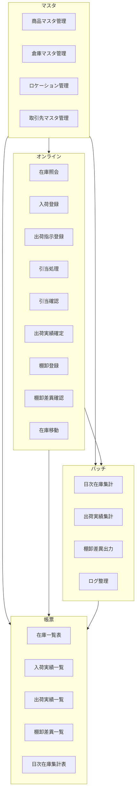

# 業務機能マップ

機能種別ごとの業務機能の配置を示します。

```mermaid
flowchart TB
    subgraph Master [マスタ]
        M001[商品マスタ管理]
        M002[倉庫マスタ管理]
        M003[ロケーション管理]
        M004[取引先マスタ管理]
    end

    subgraph Online [オンライン]
        O001[在庫照会]
        O002[入荷登録]
        O003[出荷指示登録]
        O004[引当処理]
        O005[引当確認]
        O006[出荷実績確定]
        O007[棚卸登録]
        O008[棚卸差異確認]
        O009[在庫移動]
    end

    subgraph Batch [バッチ]
        B001[日次在庫集計]
        B002[出荷実績集計]
        B003[棚卸差異出力]
        B004[ログ整理]
    end

    subgraph Report [帳票]
        R001[在庫一覧表]
        R002[入荷実績一覧]
        R003[出荷実績一覧]
        R004[棚卸差異一覧]
        R005[日次在庫集計表]
    end

    Master --> Online
    Master --> Batch
    Master --> Report
    Online --> Batch
    Online --> Report
    Batch --> Report
```
