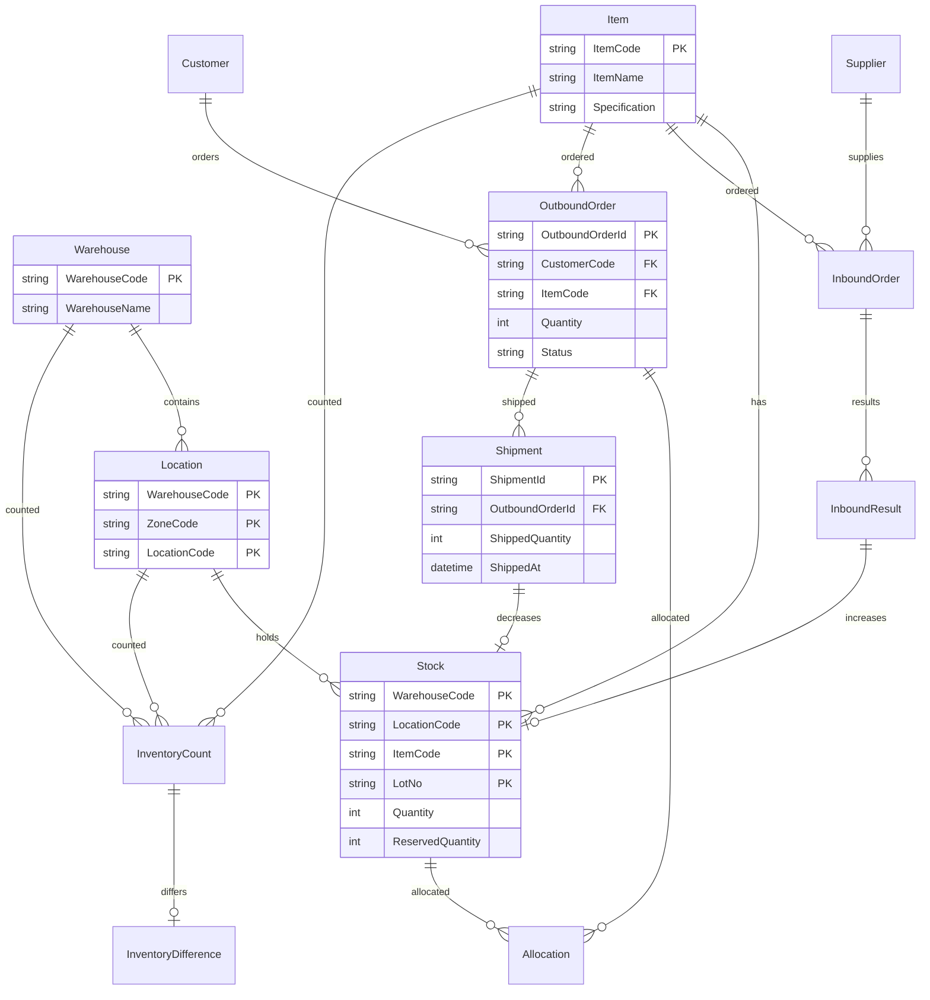

# 簡易ER図

WMSサンプルの主要エンティティと関連を示します。

```mermaid
erDiagram
    Item ||--o{ Stock : "has"
    Warehouse ||--o{ Location : "contains"
    Location ||--o{ Stock : "holds"
    Stock ||--o{ Allocation : "allocated"
    Supplier ||--o{ InboundOrder : "supplies"
    Item ||--o{ InboundOrder : "ordered"
    InboundOrder ||--o{ InboundResult : "results"
    InboundResult ||--o| Stock : "increases"
    Customer ||--o{ OutboundOrder : "orders"
    Item ||--o{ OutboundOrder : "ordered"
    OutboundOrder ||--o{ Allocation : "allocated"
    OutboundOrder ||--o{ Shipment : "shipped"
    Shipment ||--o| Stock : "decreases"
    Warehouse ||--o{ InventoryCount : "counted"
    Location ||--o{ InventoryCount : "counted"
    Item ||--o{ InventoryCount : "counted"
    InventoryCount ||--o| InventoryDifference : "differs"

    Item {
        string ItemCode PK
        string ItemName
        string Specification
    }

    Warehouse {
        string WarehouseCode PK
        string WarehouseName
    }

    Location {
        string WarehouseCode PK
        string ZoneCode PK
        string LocationCode PK
    }

    Stock {
        string WarehouseCode PK
        string LocationCode PK
        string ItemCode PK
        string LotNo PK
        int Quantity
        int ReservedQuantity
    }

    OutboundOrder {
        string OutboundOrderId PK
        string CustomerCode FK
        string ItemCode FK
        int Quantity
        string Status
    }

    Shipment {
        string ShipmentId PK
        string OutboundOrderId FK
        int ShippedQuantity
        datetime ShippedAt
    }
```
