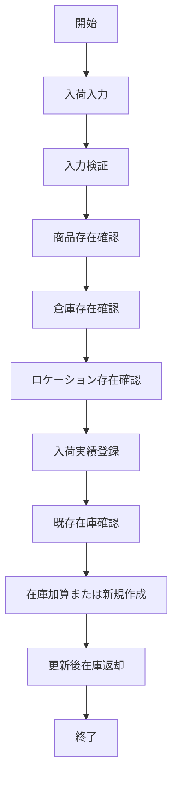

# 入荷登録フロー

```mermaid
flowchart TD
    Start[開始] --> Input[入荷入力]
    Input --> Validate[入力検証]
    Validate --> ItemCheck[商品存在確認]
    ItemCheck --> WarehouseCheck[倉庫存在確認]
    WarehouseCheck --> LocationCheck[ロケーション存在確認]
    LocationCheck --> Receipt[入荷実績登録]
    Receipt --> StockCheck[既存在庫確認]
    StockCheck --> Increase[在庫加算または新規作成]
    Increase --> Result[更新後在庫返却]
    Result --> EndNode[終了]
```
