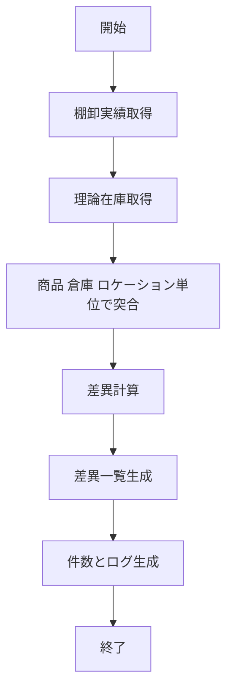

# 棚卸差異レポート生成フロー

```mermaid
flowchart TD
    Start[開始] --> LoadCounts[棚卸実績取得]
    LoadCounts --> LoadBook[理論在庫取得]
    LoadBook --> Compare[商品 倉庫 ロケーション単位で突合]
    Compare --> Calc[差異計算]
    Calc --> Build[差異一覧生成]
    Build --> Log[件数とログ生成]
    Log --> EndNode[終了]
```
