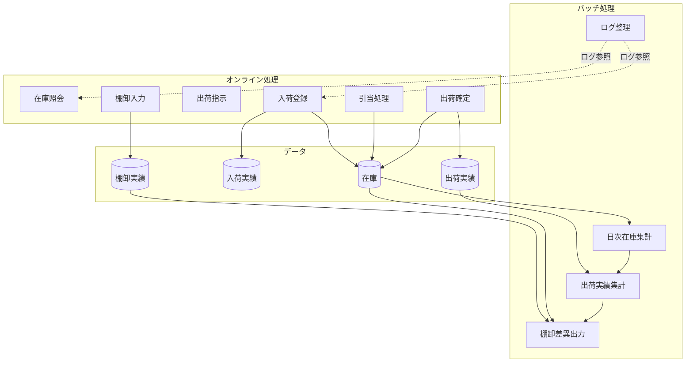
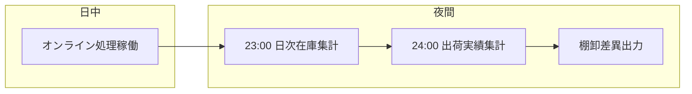

# オンライン / バッチ関係図

オンライン処理とバッチ処理の関係、データの流れを示します。

```mermaid
flowchart TB
    subgraph Online [オンライン処理]
        O1[在庫照会]
        O2[入荷登録]
        O3[出荷指示]
        O4[引当処理]
        O5[出荷確定]
        O6[棚卸入力]
    end

    subgraph Batch [バッチ処理]
        B1[日次在庫集計]
        B2[出荷実績集計]
        B3[棚卸差異出力]
        B4[ログ整理]
    end

    subgraph Data [データ]
        Stock[(在庫)]
        Inbound[(入荷実績)]
        Shipment[(出荷実績)]
        Inventory[(棚卸実績)]
    end

    O2 --> Inbound
    O2 --> Stock
    O4 --> Stock
    O5 --> Shipment
    O5 --> Stock
    O6 --> Inventory

    Stock --> B1
    Shipment --> B2
    Inventory --> B3
    Stock --> B3

    B1 --> B2
    B2 --> B3
    B4 -.->|"ログ参照"| O1
    B4 -.->|"ログ参照"| O2
```

## 実行タイミング

```mermaid
flowchart LR
    subgraph Day [日中]
        A[オンライン処理稼働]
    end

    subgraph Night [夜間]
        B[23:00 日次在庫集計]
        C[24:00 出荷実績集計]
        D[棚卸差異出力]
    end

    A --> B
    B --> C
    C --> D
```
