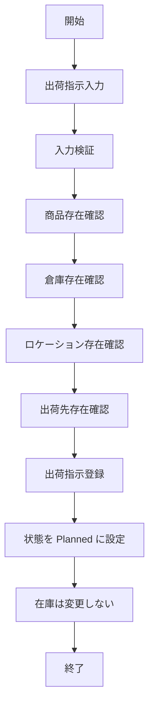

# 出荷指示登録フロー

```mermaid
flowchart TD
    Start[開始] --> Input[出荷指示入力]
    Input --> Validate[入力検証]
    Validate --> ItemCheck[商品存在確認]
    ItemCheck --> WarehouseCheck[倉庫存在確認]
    WarehouseCheck --> LocationCheck[ロケーション存在確認]
    LocationCheck --> CustomerCheck[出荷先存在確認]
    CustomerCheck --> Register[出荷指示登録]
    Register --> Status[状態を Planned に設定]
    Status --> NoStockChange[在庫は変更しない]
    NoStockChange --> EndNode[終了]
```
