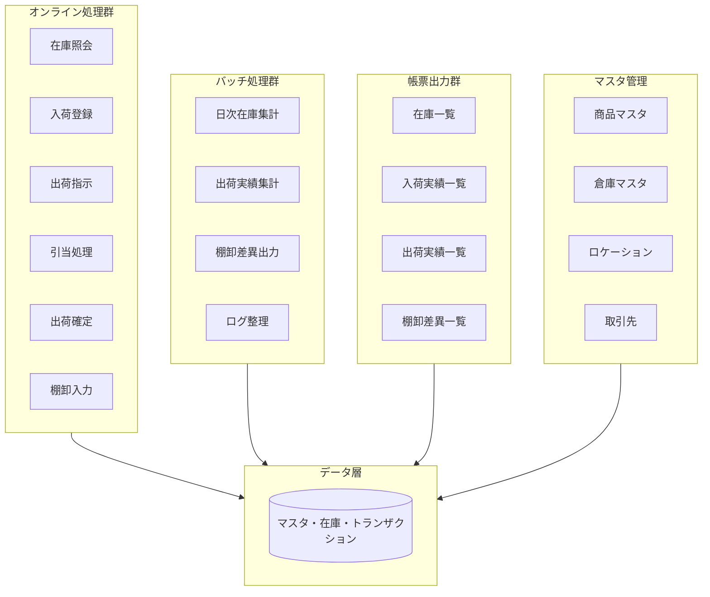

# システム全体構成図

WMSサンプルシステムの全体構成を示します。

```mermaid
flowchart TB
    subgraph Online [オンライン処理群]
        O1[在庫照会]
        O2[入荷登録]
        O3[出荷指示]
        O4[引当処理]
        O5[出荷確定]
        O6[棚卸入力]
    end

    subgraph Batch [バッチ処理群]
        B1[日次在庫集計]
        B2[出荷実績集計]
        B3[棚卸差異出力]
        B4[ログ整理]
    end

    subgraph Report [帳票出力群]
        R1[在庫一覧]
        R2[入荷実績一覧]
        R3[出荷実績一覧]
        R4[棚卸差異一覧]
    end

    subgraph Master [マスタ管理]
        M1[商品マスタ]
        M2[倉庫マスタ]
        M3[ロケーション]
        M4[取引先]
    end

    subgraph Data [データ層]
        DB[(マスタ・在庫・トランザクション)]
    end

    Online --> Data
    Batch --> Data
    Report --> Data
    Master --> Data
```
