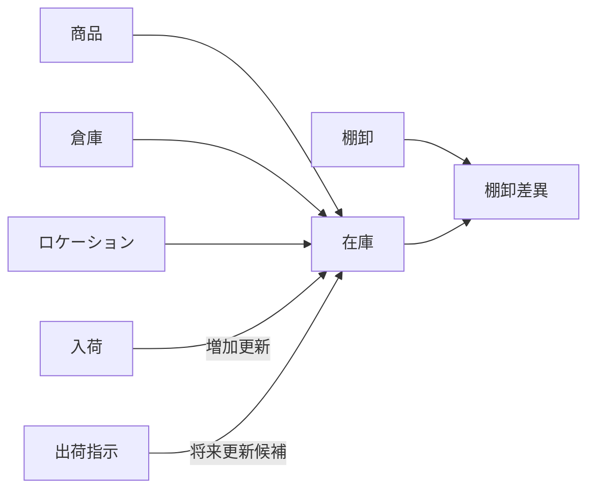

# 更新責務図

```mermaid
flowchart LR
    Item[商品]
    Warehouse[倉庫]
    Location[ロケーション]
    Stock[在庫]
    Inbound[入荷]
    Outbound[出荷指示]
    InventoryCount[棚卸]
    Difference[棚卸差異]

    Item --> Stock
    Warehouse --> Stock
    Location --> Stock
    Inbound -->|"増加更新"| Stock
    Outbound -->|"将来更新候補"| Stock
    InventoryCount --> Difference
    Stock --> Difference
```
