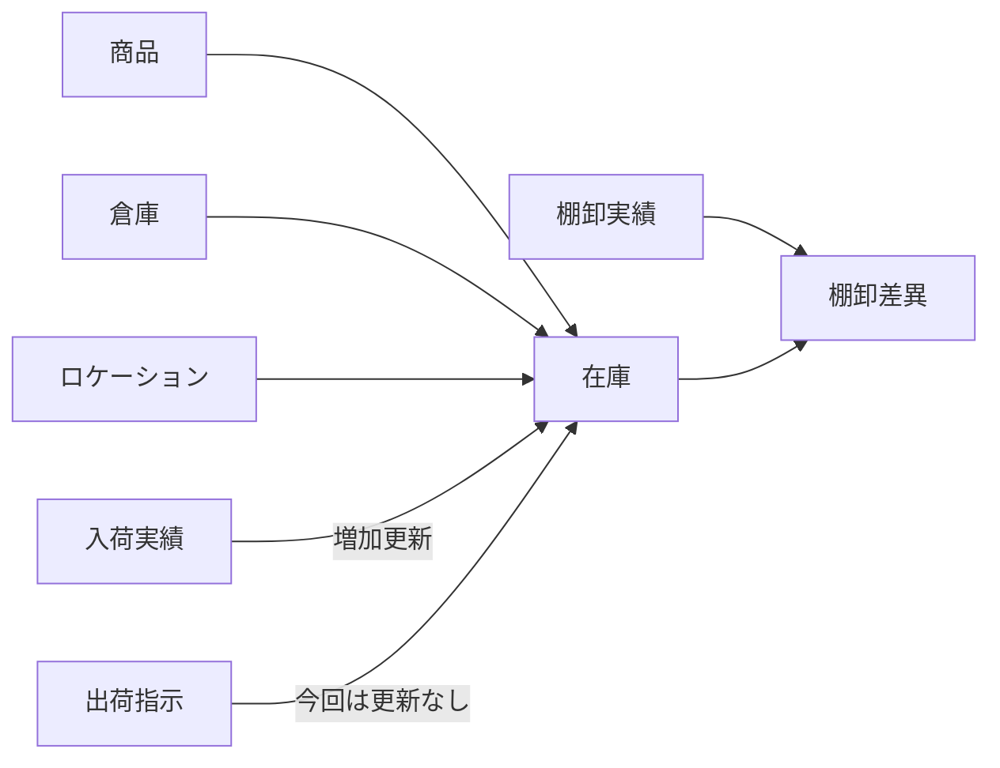

# 業務イベントと更新対象

## 概要

第2段階で実装した代表機能について、どの業務イベントがどのエンティティを更新し、在庫増減の有無と保証単位候補がどう見えるかを整理します。

---

## 業務イベント一覧

| 業務イベント | 更新対象エンティティ | 在庫増減 | 区分 | 将来の保証単位候補 |
|--------------|----------------------|----------|------|--------------------|
| 在庫照会 | なし | なし | オンライン | 照会のみのため保証単位なし |
| 入荷登録 | `InboundReceipt`, `Stock` | 増加 | オンライン | 入荷実績登録と在庫加算の一括保証 |
| 出荷指示登録 | `OutboundOrder` | なし | オンライン | 出荷指示イベント登録の一括保証 |
| 日次在庫集計 | `DailyStockSnapshot` | なし | バッチ | 実行日単位のスナップショット保存 |
| 棚卸差異レポート作成 | なし（差異結果を都度生成） | なし | バッチ | 棚卸日単位の差異一覧生成 |
| 在庫一覧表出力 | なし | なし | 帳票 | 出力生成のみのため保証単位なし |

---

## 在庫更新の見え方

| 処理 | `Stock` 更新 | 更新方向 | 補足 |
|------|--------------|----------|------|
| 在庫照会 | なし | なし | 読み取り専用 |
| 入荷登録 | あり | 増加 | 未存在在庫は新規作成 |
| 出荷指示登録 | なし | なし | 将来の引当・出荷確定で減少予定 |
| 棚卸差異レポート | なし | なし | 理論在庫と実棚の比較のみ |

---

## 更新責務図

---

## 保証単位として見た論点

### 入荷登録

- `InboundReceipt` の登録と `Stock` 更新が連続している
- 研究上は、同一業務イベント内の複数更新として保証単位を定義しやすい

### 出荷指示登録

- 現段階では `OutboundOrder` のみを更新する
- 将来、引当・出荷確定が加わると、イベント登録と在庫更新の責務分割比較に使える

### 日次在庫集計

- オンライン更新後の状態を参照し、日付単位のスナップショットとして固定化する
- 将来のバッチ保証単位では「実行日単位」の整合性が論点になる

### 棚卸差異レポート

- `InventoryCount` と理論在庫の突合処理であり、更新よりも比較・検証責務が中心
- どの時点の理論在庫を前提にするかが保証空間研究の論点になる

---

## 関連図

- `diagrams/update-responsibility-map.md`
