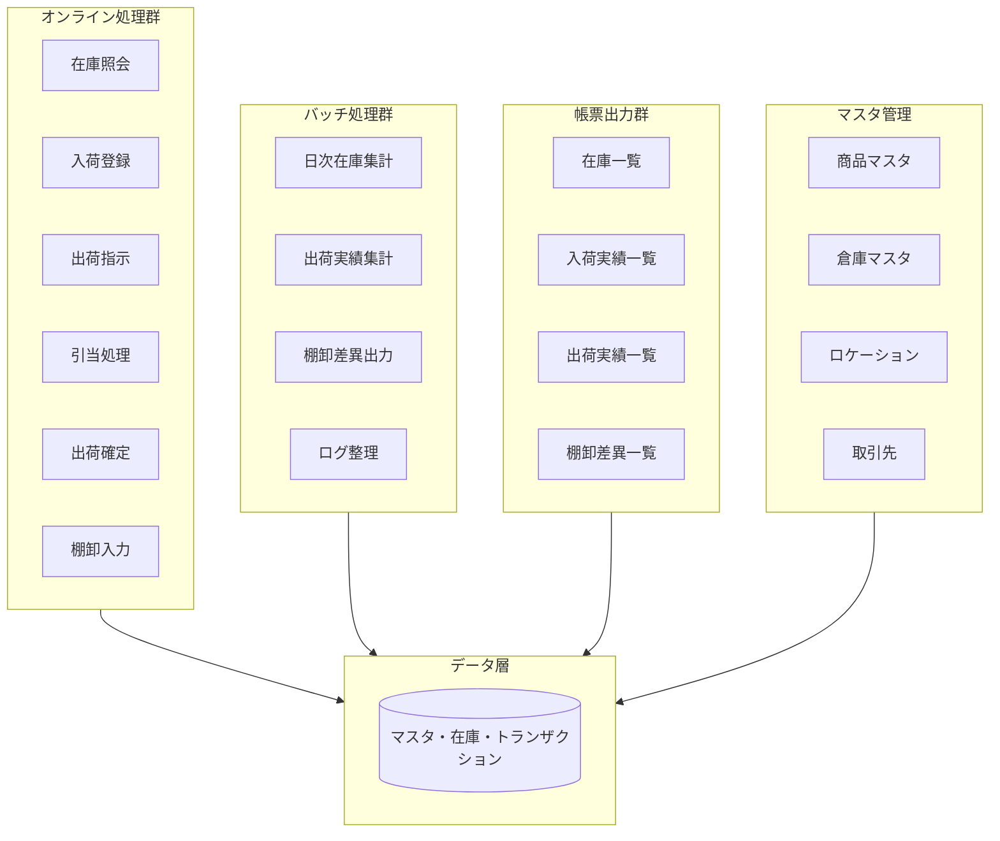
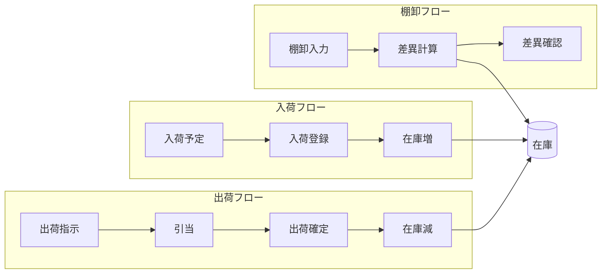

# システム構成

## システム全体像

本WMSサンプルは、オンライン処理・バッチ処理・帳票出力・マスタ管理の4つの処理群で構成されます。

---

## オンライン処理群

| 処理 | 責務 | 更新対象 |
|------|------|----------|
| 在庫照会 | 照会のみ、更新なし | なし |
| 入荷登録 | 入荷実績登録、在庫増 | Stock, InboundReceipt |
| 出荷指示登録 | 出荷指示の登録 | OutboundOrder |
| 引当処理 | 在庫引当、確保 | Allocation, Stock |
| 出荷確定 | 出荷実績確定、在庫減 | Shipment, Stock |
| 棚卸入力 | 棚卸実績登録 | InventoryCount |

オンライン処理は**トランザクション単位**で実行され、1画面1トランザクションを想定します。

---

## バッチ処理群

| バッチ | 実行契機 | 主な処理 |
|--------|----------|----------|
| 日次在庫集計 | 日次（例: 23:00） | Stock を集計しサマリ作成 |
| 出荷実績集計 | 日次 | Shipment を集計 |
| 棚卸差異出力 | 棚卸完了後 | 帳簿在庫と実棚卸の差異を出力 |
| ログ整理 | 週次 | 古いログのアーカイブ・削除 |

バッチは**オンラインと分離**し、夜間・休止時間帯の実行を想定します。

---

## 帳票出力群

| 帳票 | 出力元 | 用途 |
|------|--------|------|
| 在庫一覧表 | Stock | 在庫確認 |
| 入荷実績一覧 | InboundReceipt | 入荷履歴確認 |
| 出荷実績一覧 | Shipment | 出荷履歴確認 |
| 棚卸差異一覧 | InventoryCount, Stock | 棚卸差異確認 |
| 日次在庫集計表 | 日次集計結果 | 日次サマリ |

帳票は**オンライン画面**または**バッチ出力**のいずれかで提供されます。

---

## マスタ管理

| マスタ | 用途 |
|--------|------|
| 商品マスタ | 商品の基本情報 |
| 倉庫マスタ | 倉庫の基本情報 |
| ロケーション | 棚・保管場所の定義 |
| 取引先マスタ | 仕入先・得意先 |

マスタは**オンライン画面**で登録・更新し、**バッチ・帳票**から参照されます。

---

## データの流れ

---

## 将来のCOBOL構造模倣ポイント

| 現行構造 | COBOL模倣時の対応 |
|----------|-------------------|
| オンライン処理 | 1画面 = 1COBOLプログラム（CICS等） |
| バッチ処理 | 1バッチ = 1COBOLバッチプログラム |
| 帳票出力 | 帳票出力 = 帳票用COBOLプログラム |
| マスタ参照 | 共通サブプログラムまたはコピー |
| 在庫更新 | トランザクション境界 = 保証単位 |

移行研究では、上記の対応関係を明示し、依存関係・保証単位を分析できるようにします。
