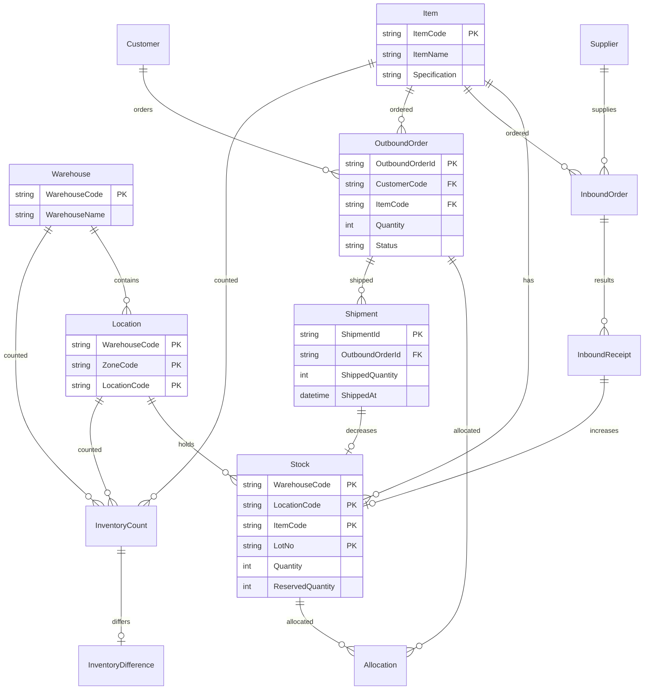

# データモデル

## 概要

本WMSサンプルで扱う主要エンティティの定義です。業務責務と関連を明確にし、将来のCOBOL構造模倣・移行分析に利用できるようにしています。

---

## エンティティ一覧

### Item（商品）

| 項目 | 内容 |
|------|------|
| 役割 | 商品の基本情報を保持するマスタ |
| 主キー | ItemCode |
| 主な属性 | ItemCode, ItemName, Specification, Unit, Status |
| 関連 | Stock（在庫）、InboundOrder、OutboundOrder |
| 業務上の意味 | 入出荷・在庫管理の対象となる商品を定義 |

### Warehouse（倉庫）

| 項目 | 内容 |
|------|------|
| 役割 | 倉庫の基本情報を保持するマスタ |
| 主キー | WarehouseCode |
| 主な属性 | WarehouseCode, WarehouseName, Address, Status |
| 関連 | Location、Stock |
| 業務上の意味 | 在庫を保有する物理的な倉庫を定義 |

### Location（ロケーション）

| 項目 | 内容 |
|------|------|
| 役割 | 倉庫内の保管場所（棚・ゾーン）を定義するマスタ |
| 主キー | WarehouseCode + ZoneCode + LocationCode |
| 主な属性 | WarehouseCode, ZoneCode, LocationCode, LocationType |
| 関連 | Warehouse、Stock |
| 業務上の意味 | 在庫の保管場所を特定するための階層構造 |

### Stock（在庫）

| 項目 | 内容 |
|------|------|
| 役割 | 倉庫・ロケーション・商品ごとの現在在庫数を保持 |
| 主キー | WarehouseCode + LocationCode + ItemCode + LotNo |
| 主な属性 | Quantity, ReservedQuantity, LastUpdated |
| 関連 | Warehouse, Location, Item |
| 業務上の意味 | 入荷で増加、出荷・引当で減少。棚卸の比較対象 |

### Supplier（仕入先）

| 項目 | 内容 |
|------|------|
| 役割 | 仕入先の基本情報を保持するマスタ |
| 主キー | SupplierCode |
| 主な属性 | SupplierCode, SupplierName, ContactInfo |
| 関連 | InboundOrder |
| 業務上の意味 | 入荷元の取引先を定義 |

### Customer（得意先）

| 項目 | 内容 |
|------|------|
| 役割 | 得意先の基本情報を保持するマスタ |
| 主キー | CustomerCode |
| 主な属性 | CustomerCode, CustomerName, DeliveryAddress |
| 関連 | OutboundOrder |
| 業務上の意味 | 出荷先の取引先を定義 |

### InboundOrder（入荷予定）

| 項目 | 内容 |
|------|------|
| 役割 | 入荷予定情報を保持 |
| 主キー | InboundOrderId |
| 主な属性 | ExpectedDate, ItemCode, ExpectedQuantity, SupplierCode |
| 関連 | Supplier, Item, InboundReceipt |
| 業務上の意味 | 入荷登録の入力元。実績登録で InboundReceipt が生成される |

### InboundReceipt（入荷実績）

| 項目 | 内容 |
|------|------|
| 役割 | 入荷実績を保持。在庫増の根拠 |
| 主キー | InboundReceiptId |
| 主な属性 | InboundOrderId, ActualQuantity, LotNo, ReceivedAt |
| 関連 | InboundOrder, Stock |
| 業務上の意味 | 入荷登録で作成。在庫増と1:1対応 |

### OutboundOrder（出荷指示）

| 項目 | 内容 |
|------|------|
| 役割 | 出荷指示を保持 |
| 主キー | OutboundOrderId |
| 主な属性 | CustomerCode, ItemCode, Quantity, RequestedDate, Status |
| 関連 | Customer, Item, Allocation, Shipment |
| 業務上の意味 | 出荷指示登録で作成。引当→出荷確定の流れ |

### Allocation（引当）

| 項目 | 内容 |
|------|------|
| 役割 | 出荷指示に対する在庫引当を保持 |
| 主キー | AllocationId |
| 主な属性 | OutboundOrderId, StockId, AllocatedQuantity |
| 関連 | OutboundOrder, Stock |
| 業務上の意味 | 引当処理で作成。在庫の ReservedQuantity を更新 |

### Shipment（出荷実績）

| 項目 | 内容 |
|------|------|
| 役割 | 出荷確定実績を保持 |
| 主キー | ShipmentId |
| 主な属性 | OutboundOrderId, ShippedQuantity, ShippedAt |
| 関連 | OutboundOrder, Stock |
| 業務上の意味 | 出荷確定で作成。在庫減の根拠 |

### InventoryCount（棚卸実績）

| 項目 | 内容 |
|------|------|
| 役割 | 棚卸で計上した実数量を保持 |
| 主キー | InventoryCountId |
| 主な属性 | WarehouseCode, LocationCode, ItemCode, CountedQuantity, CountedAt |
| 関連 | Stock |
| 業務上の意味 | 棚卸入力で作成。帳簿在庫との差異計算の元データ |

### InventoryDifference（棚卸差異）

| 項目 | 内容 |
|------|------|
| 役割 | 帳簿在庫と実棚卸の差異を保持 |
| 主キー | InventoryCountId（または差分ID） |
| 主な属性 | BookQuantity, CountedQuantity, DifferenceQuantity |
| 関連 | InventoryCount, Stock |
| 業務上の意味 | 棚卸差異計算で生成。差異確認・レポートの対象 |

---

## 簡易ER図

