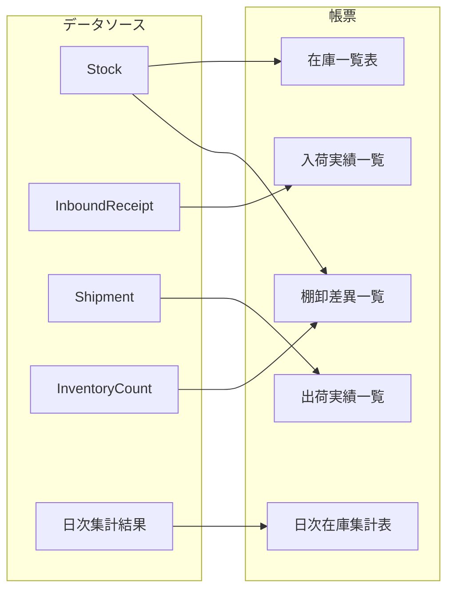

# 帳票一覧

## 概要

本WMSサンプルで出力する帳票の一覧です。各帳票の用途、出力元データ、主要項目、想定フォーマットを定義します。

---

## 1. 在庫一覧表

| 項目 | 内容 |
|------|------|
| 帳票ID | R001 |
| 名称 | 在庫一覧表 |
| 用途 | 倉庫・商品・ロケーション別の現在在庫の確認 |
| 出力元データ | Stock, Item, Location, Warehouse |
| 主要項目 | 倉庫、ロケーション、商品コード、商品名、数量、引当数量、有効数量 |
| 想定フォーマット | CSV、画面表示 |

---

## 2. 入荷実績一覧

| 項目 | 内容 |
|------|------|
| 帳票ID | R002 |
| 名称 | 入荷実績一覧 |
| 用途 | 入荷実績の履歴確認、入荷トレース |
| 出力元データ | InboundReceipt, InboundOrder, Item, Supplier |
| 主要項目 | 入荷実績ID、入荷予定ID、商品、数量、ロット、入荷日時、仕入先 |
| 想定フォーマット | CSV、PDF、画面表示 |

---

## 3. 出荷実績一覧

| 項目 | 内容 |
|------|------|
| 帳票ID | R003 |
| 名称 | 出荷実績一覧 |
| 用途 | 出荷実績の履歴確認、出荷トレース |
| 出力元データ | Shipment, OutboundOrder, Item, Customer |
| 主要項目 | 出荷実績ID、出荷指示番号、得意先、商品、出荷数量、出荷日時 |
| 想定フォーマット | CSV、PDF、画面表示 |

---

## 4. 棚卸差異一覧

| 項目 | 内容 |
|------|------|
| 帳票ID | R004 |
| 名称 | 棚卸差異一覧 |
| 用途 | 帳簿在庫と実棚卸の差異確認、差異分析 |
| 出力元データ | InventoryCount, Stock, Item, Location |
| 主要項目 | 倉庫、ロケーション、商品、帳簿数量、実数量、差異数量、差異率 |
| 想定フォーマット | CSV、PDF、画面表示 |

---

## 5. 日次在庫集計表

| 項目 | 内容 |
|------|------|
| 帳票ID | R005 |
| 名称 | 日次在庫集計表 |
| 用途 | 日次の在庫サマリ、トレンド確認 |
| 出力元データ | 日次在庫集計バッチ（B001）の出力 |
| 主要項目 | 集計日、倉庫、商品、前日残、入荷数、出荷数、当日残 |
| 想定フォーマット | CSV、PDF |

---

## 帳票と出力元の対応

