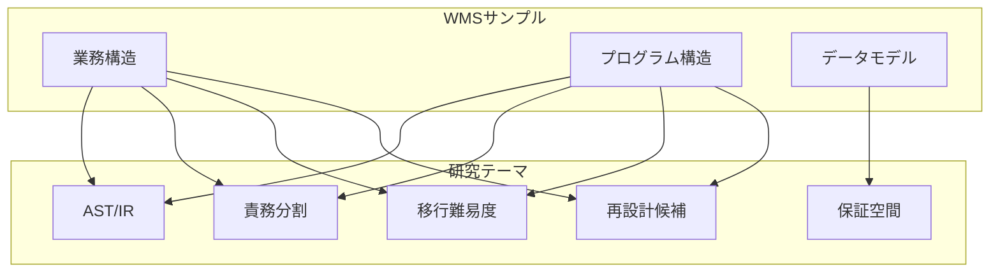

# 研究ユースケース

## 概要

本WMSサンプルシステムを、どのような研究に利用できるかを整理した文書です。移行設計・構造解析・保証空間研究の各テーマとの接続ポイントを明示します。

---

## AST研究への接続

### 接続ポイント

- **処理フローの構文木化**: 入荷登録、引当処理、出荷確定などの処理フローを、制御フローとして表現し、AST（抽象構文木）に対応づける
- **COBOL模倣時の対応**: 将来的にCOBOLプログラムを追加した場合、PERFORM、IF、EVALUATE などの構造をASTとして解析し、本サンプルの処理単位とマッピングする
- **実験対象**: 在庫更新の分岐（入荷/出荷/棚卸）を、条件分岐のASTノードとして分析

### 想定する研究課題

- 処理単位とASTノードの対応関係の可視化
- 分岐深度・循環複雑度の算出

---

## IR研究への接続

### 接続ポイント

- **中間表現への変換**: 業務処理（在庫増減、引当、棚卸差異計算）を、データフローの中間表現（IR）に変換する
- **依存関係の表現**: エンティティ間の読み書き依存をIRとして表現し、データフローグラフ（DFG）を構築する
- **保証単位の境界**: トランザクション境界をIRのブロック境界として表現

### 想定する研究課題

- 在庫更新のデータフローをIRで表現
- 引当→出荷確定の一連の流れをDFGとして可視化

---

## 責務分割研究への接続

### 接続ポイント

- **モジュール責務**: Domain（Item, Stock等）、Application（在庫照会、入荷登録等）、Infrastructure の責務境界を分析
- **画面-帳票-バッチの責務**: オンライン処理、バッチ処理、帳票出力の責務がどのように分離されているかを評価
- **COBOL的責務**: 将来的にCOBOLプログラム単位に分割した場合、責務の粒度が適切かどうかを検証

### 想定する研究課題

- 責務境界の明確さの評価指標
- 密結合箇所の特定

---

## 保証空間研究への接続

### 接続ポイント

- **在庫更新の保証単位**: 入荷登録（在庫増）、出荷確定（在庫減）、引当（予約）が、それぞれトランザクションとしてどの範囲を保証するか
- **一貫性境界**: 複数テーブル（Stock, InboundResult 等）を更新する処理の原子性
- **棚卸差異**: 帳簿在庫と実棚卸の突合が、どの時点のスナップショットを前提とするか

### 想定する研究課題

- 在庫更新のトランザクション境界の定義
- 保証単位とCOBOLプログラムの対応

---

## 移行難易度評価への接続

### 接続ポイント

- **依存関係の複雑さ**: エンティティ間、処理間の依存から難易度スコアを算出
- **更新の集中度**: 在庫更新が集中する処理（入荷、出荷、引当）の移行リスク評価
- **バッチとオンラインの分離度**: 分離が明確であれば移行が容易、密結合であれば難易度が高い

### 想定する研究課題

- 依存グラフに基づく難易度スコアリング
- 移行順序の最適化

---

## 再設計候補抽出への接続

### 接続ポイント

- **責務混在の検出**: 1つの処理が複数責務を持つ場合、分割候補として抽出
- **重複ロジック**: 在庫増減、引当計算など、類似ロジックの共通化候補
- **境界の曖昧さ**: マスタとトランザクションの境界が曖昧な箇所の特定

### 想定する研究課題

- リファクタリング候補の自動抽出
- 再設計時の責務再配置案の生成

---

## 研究利用の流れ（概念図）

