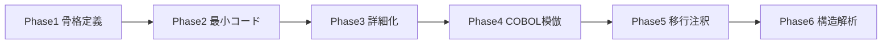

# 将来拡張計画（ロードマップ）

## 概要

本WMSサンプルリポジトリの段階的な拡張計画です。研究対象としての扱いやすさを維持しつつ、段階的に機能を追加していく方針です。

---

## Phase 1: 骨格定義（完了）

| 項目 | 内容 |
|------|------|
| 目的 | リポジトリの骨格と文書基盤を整備 |
| 成果物 | ディレクトリ構成、README、設計文書、.gitignore、LICENSE |
| 状態 | 完了 |

---

## Phase 2: 最小コード追加

| 項目 | 内容 |
|------|------|
| 目的 | コンパイル可能な最小限のC#コードを追加 |
| 成果物 | Wms.Domain（エンティティ雛形）、Wms.Application（ユースケース雛形）、Wms.ConsoleDemo |
| 方針 | 実装は最小限。過剰実装しない |

### 追加するエンティティ

- Item, Warehouse, Location, Stock
- InboundOrder, OutboundOrder, Shipment
- InventoryCount

### 追加するユースケース

- 在庫照会
- 入荷登録
- 出荷指示登録
- 棚卸差異計算

---

## Phase 3: 画面 / 帳票 / バッチ詳細化

| 項目 | 内容 |
|------|------|
| 目的 | 各機能の仕様を詳細化し、画面・帳票・バッチの責務を明確化 |
| 成果物 | 画面仕様書、帳票レイアウト、バッチ処理フロー図 |
| 方針 | 実装は行わず、文書による詳細化を優先 |

### 詳細化対象

- オンライン処理の画面遷移・入力検証ルール
- 帳票の項目定義・出力フォーマット
- バッチの実行順序・エラーリカバリ

---

## Phase 4: COBOL的構造の模倣

| 項目 | 内容 |
|------|------|
| 目的 | 現行構造をCOBOLプログラム単位にマッピング可能にする |
| 成果物 | COBOLプログラム対応表、模倣用のCOBOL風コードまたは注釈 |
| 方針 | 1画面=1プログラム、1バッチ=1プログラムの対応を明示 |

### 模倣ポイント

- オンライン処理をCICS風のトランザクション単位に分割
- バッチをJCL相当の実行単位に分割
- 共通サブプログラム（マスタ参照等）の抽出

---

## Phase 5: 移行分析用注釈追加

| 項目 | 内容 |
|------|------|
| 目的 | 移行難易度評価・依存解析に使える注釈を追加 |
| 成果物 | 注釈付きコード、依存関係メタデータ |
| 方針 | コードまたはメタデータに、移行分析用のタグ・属性を付与 |

### 注釈例

- 保証単位の境界
- 他モジュールへの依存
- 移行難易度の目安

---

## Phase 6: 構造解析対象としての整備

| 項目 | 内容 |
|------|------|
| 目的 | AST/IR/CFG/DFG解析の実験対象として整備 |
| 成果物 | 解析用のメタデータ、サンプル解析スクリプト |
| 方針 | 構造解析ツールが読み込みやすい形式でデータを提供 |

### 整備内容

- モジュール依存グラフのエクスポート
- 処理フローの構造化表現
- 保証単位の境界定義

---

## ロードマップ概要図

---

## 注意事項

- 各Phaseは独立して進められるが、Phase 1→2→3 の順序は推奨
- Phase 4以降は、研究テーマに応じて並行またはスキップ可能
- 本番業務システム化は想定していない
